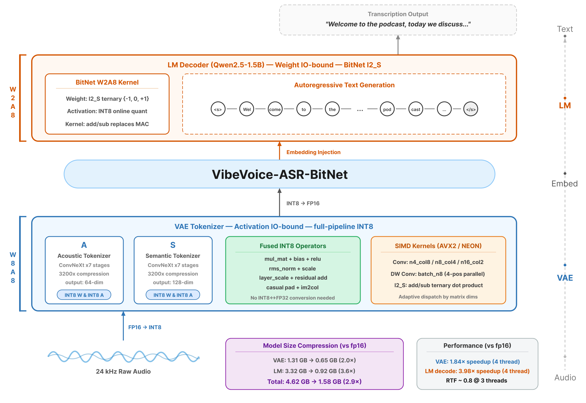

<h1 align="center">VibeASR.cpp</h1>

<p align="center">
  <a href="https://opensource.org/licenses/MIT"></a>
  <a href="https://huggingface.co/microsoft/VibeVoice-ASR/tree/cpu"></a>
  <a href="https://arxiv.org/abs/2507.XXXXX"></a>
</p>

<p align="center">
  📄 <a href="https://arxiv.org/abs/2507.XXXXX">Tech Report</a> &nbsp;|&nbsp;
  🤗 <a href="https://huggingface.co/microsoft/VibeVoice-ASR/tree/cpu">Models</a> &nbsp;|&nbsp;
  🏠 <a href="https://aka.ms/GeneralAI">GeneralAI</a>
</p>

---

**VibeASR.cpp** is the official inference runtime for **VibeVoice-ASR-BitNet** — enabling real-time multilingual speech recognition on CPU through heterogeneous quantization (I8\_S for VAE + I2\_S for LM).

To enable efficient edge CPU deployment, we replace the original Qwen2.5-7B language model with Qwen2.5-1.5B, achieving only modest accuracy degradation (1–4% absolute WER increase) while reducing the total model size from 4.62 GB to 1.58 GB. Combined with custom SIMD kernels and operator fusion in the ggml framework, VibeVoice-ASR-BitNet achieves **1.6–2.3× faster** inference than Whisper.cpp at comparable model sizes, with real-time capability (RTF < 1) on low-resource CPUs.

<p align="center">
  
</p>

---

## Key Results

### Model Size

<div align="center">

| Component | VibeVoice-ASR-1.5B (FP16) | VibeVoice-ASR-BitNet | Compression |
|-----------|:-------------------------:|:--------------------:|:-----------:|
| VAE Tokenizer | 1.31 GB | 0.65 GB (I8\_S) | 2.0× |
| LM Decoder | 3.32 GB | 0.92 GB (I2\_S + Q6\_K embed) | 3.6× |
| **Total** | **4.62 GB** | **1.58 GB** | **2.9×** |

</div>

### Inference Performance

<div align="center">

| Audio Duration | 1 Thread | 2 Threads | 3 Threads | 4 Threads | 6 Threads | 8 Threads |
|:--------------:|:--------:|:---------:|:---------:|:---------:|:---------:|:---------:|
| 5 s  | 2.11 | 1.22 | **0.89** | **0.76** | **0.60** | **0.54** |
| 10 s | 2.05 | 1.13 | **0.82** | **0.69** | **0.53** | **0.47** |
| 20 s | 1.98 | 1.08 | **0.77** | **0.63** | **0.49** | **0.42** |
| 40 s | 1.96 | 1.05 | **0.76** | **0.61** | **0.47** | **0.41** |

</div>

<div align="center">

| Threads | 1T | 2T | 4T | 6T | 8T |
|:--------|:--:|:--:|:--:|:--:|:--:|
| VibeVoice-ASR-BitNet (1.6 GB) | 44.8s | 25.2s | 15.3s | 11.5s | 10.0s |
| Whisper.cpp large-v3-turbo (1.6 GB) | 102.1s | 53.3s | 28.4s | 19.7s | 15.5s |
| **Speedup** | **2.28×** | **2.12×** | **1.86×** | **1.71×** | **1.55×** |

</div>

> Benchmarked on AMD EPYC 7V13 (24 cores, AVX2+FMA), 20s English audio. **Bold** = RTF < 1 (real-time).

### Accuracy (WER% / CER%)

<div align="center">

| | Benchmark | VibeVoice-ASR-7B | | VibeVoice-ASR-BitNet* | | Parakeet | | Whisper | | SenseVoice | | FunASR | |
|--|-----------|:---:|:---:|:---:|:---:|:---:|:---:|:---:|:---:|:---:|:---:|:---:|:---:|
| | | WER | CER | WER | CER | WER | CER | WER | CER | WER | CER | WER | CER |
| MLC | EN | 7.82 | 4.51 | **8.25** | **4.87** | 8.40 | 5.03 | 13.57 | 10.34 | 12.39 | 7.56 | 11.36 | 7.53 |
| | FR | 16.03 | 9.78 | 17.41 | 10.62 | — | — | — | — | — | — | — | — |
| | IT | 15.67 | 6.94 | 17.23 | 7.58 | — | — | — | — | — | — | — | — |
| | KO | 9.83 | 9.83 | 11.15 | 11.15 | — | — | — | — | — | — | — | — |
| | PT | 22.41 | 12.68 | 24.87 | 14.03 | — | — | — | — | — | — | — | — |
| | VI | 20.15 | 12.87 | 22.38 | 14.21 | — | — | — | — | — | — | — | — |
| Std | AISHELL4 (ZH) | 19.83 | 19.83 | 27.45 | 27.45 | — | — | — | — | 22.52 | 22.52 | **20.41** | **20.41** |
| | AMI-ihm (EN) | 17.42 | 13.56 | **21.36** | **16.91** | 21.92 | 17.68 | 27.07 | 21.91 | 30.81 | 25.71 | 32.07 | 26.13 |
| | AMI-sdm (EN) | 24.18 | 18.73 | **25.87** | **20.94** | 26.33 | 21.26 | 36.92 | 31.37 | 48.11 | 42.67 | 40.17 | 32.39 |
| | AliMeeting (ZH) | 36.21 | 36.21 | 40.58 | 40.58 | — | — | — | — | **38.75** | **38.75** | 39.27 | 39.27 |
| | Fleurs-en (EN) | 4.73 | 2.05 | 5.21 | 2.28 | 4.09 | 1.67 | **3.99** | **1.64** | 6.84 | 2.81 | 4.93 | 2.20 |
| | Fleurs-zh (ZH) | 7.92 | 7.92 | 8.35 | 8.35 | — | — | — | — | **5.56** | **5.56** | 7.00 | 7.00 |
| | Libri-clean (EN) | 2.17 | 0.88 | 2.41 | 0.95 | **1.49** | **0.46** | 1.98 | 0.77 | 2.78 | 1.07 | 1.58 | 0.56 |
| | Libri-other (EN) | 5.84 | 2.94 | 6.27 | 3.18 | **3.13** | **1.16** | 3.60 | 1.52 | 6.81 | 3.31 | 4.01 | 1.77 |
| | VoxPopuli (EN) | 4.92 | 2.73 | **5.18** | **2.96** | 5.26 | 3.04 | 7.19 | 4.43 | 8.63 | 4.71 | 6.46 | 3.71 |

</div>

> \*This work. VibeVoice-ASR-7B is included as an upper-bound reference (4.7× larger LM, not ranked). **Bold** marks the best among comparable-size models. Parakeet: Nvidia Parakeet-TDT-0.6B-v2; Whisper: OpenAI Whisper Large-v3; SenseVoice: SenseVoice-small; FunASR: FunASR-Nano. "—" = unsupported language.

---

## Quick Start

### Requirements

- Python ≥ 3.9, CMake ≥ 3.14, GCC/Clang with C++11 support
- ~2 GB disk space (code + quantized models)

### One-Command Setup

```bash
git clone --recursive https://github.com/microsoft/VibeASR.cpp.git
cd VibeASR.cpp
pip install -r requirements.txt
python setup_env.py
```

### Manual Build

```bash
git clone --recursive https://github.com/microsoft/VibeASR.cpp.git
cd VibeASR.cpp

# Build
cmake -B build -DCMAKE_BUILD_TYPE=Release
cmake --build build -j$(nproc)

# Download pre-quantized models
pip install huggingface_hub
huggingface-cli download microsoft/VibeVoice-ASR --revision cpu --local-dir models/vibeasr
```

---

## Usage

### CLI Inference

```bash
./build/bin/asr_infer \
    --vae-model models/vibeasr/vibeasr-vae-encoder-i8_s.gguf \
    --lm-model models/vibeasr/vibeasr-lm-i2_s-embed-q6_k.gguf \
    --audio input.wav -t 4
```

### Web Demo (Gradio)

```bash
pip install gradio soundfile numpy
python demo/gradio_asr_demo.py --port 7860
```

The demo automatically loads models from `models/vibeasr/`. To use a custom model path:

```bash
python demo/gradio_asr_demo.py --port 7860 \
    --bin ./build/bin/asr_infer \
    --server-bin ./build/bin/asr_stream_server
```

---

## Model Conversion

For most users, downloading pre-quantized models from [HuggingFace](https://huggingface.co/microsoft/VibeVoice-ASR/tree/cpu) is recommended. To convert from SafeTensors yourself:

### Step 1: SafeTensors → F32 GGUF

```bash
# LM (BitNet) — handles weight preprocessing and config flattening automatically
python utils/convert_lm_to_gguf.py <safetensors-dir>

# VAE Encoder
python utils/convert_vae_to_gguf.py <safetensors-dir>
```

### Step 2: F32 GGUF → Quantized GGUF

```bash
# VAE: F32 → I8_S
./build/bin/llama-quantize \
    <safetensors-dir>/vibeasr-vae-encoder-f32.gguf \
    <safetensors-dir>/vibeasr-vae-encoder-i8_s.gguf \
    I8_S 1 1

# LM: F32 → I2_S (with Q6_K embeddings)
./build/bin/llama-quantize --token-embedding-type Q6_K \
    <safetensors-dir>/vibeasr-lm-f32.gguf \
    <safetensors-dir>/vibeasr-lm-i2_s-embed-q6_k.gguf \
    I2_S 1 1
```

---

## Citation

```bibtex
@article{xu2025vibeasrbitnet,
    title={VibeVoice-ASR-BitNet Technical Report},
    author={Xu, Songchen and Song, Ting and Huang, Shaohan and Peng, Zhiliang and Xia, Yan and Tu, Yujie and Huang, Xin and Yu, Jianwei and Dong, Li and Wei, Furu},
    journal={arXiv preprint arXiv:2507.XXXXX},
    year={2025}
}
```

---

## License

This project is licensed under the [MIT License](LICENSE).
