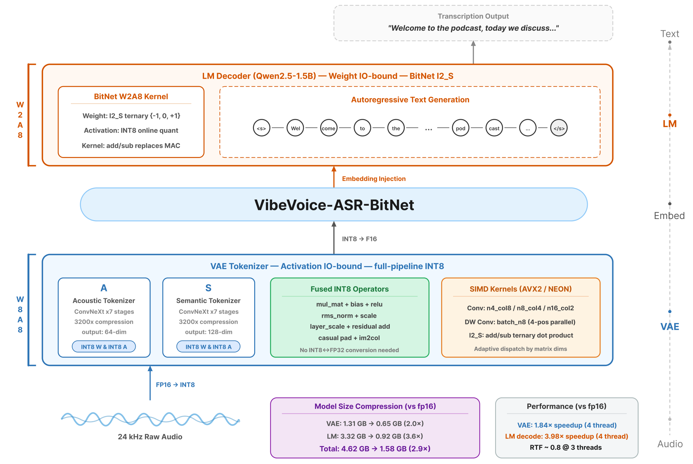

# VibeASR.cpp

[](https://opensource.org/licenses/MIT)
[](https://huggingface.co/microsoft/VibeVoice-ASR-Lite)
[](https://arxiv.org/abs/TODO)

VibeASR.cpp is the official inference runtime for [VibeVoice-ASR-BitNet](https://huggingface.co/microsoft/VibeVoice-ASR-Lite) — enabling **real-time multilingual speech recognition on CPU** through heterogeneous quantization. It achieves **1.6–2.3× faster** inference than whisper.cpp at comparable model size, with real-time capability (RTF < 1) using as few as **3 CPU threads**.

<p align="center">
  
</p>

<p align="center">
  📄 <a href="https://arxiv.org/abs/TODO">Tech Report</a> &nbsp;|&nbsp;
  🤗 <a href="https://huggingface.co/microsoft/VibeVoice-ASR-Lite">Models</a> &nbsp;|&nbsp;
  🏠 <a href="https://github.com/microsoft/VibeVoice">VibeVoice</a>
</p>

---

## Key Results

|  | FP16 | VibeASR-BitNet | Compression |
|--|------|-------------|:-----------:|
| VAE Tokenizer | 1.31 GB | 0.65 GB (I8_S) | 2.0× |
| LM Decoder | 3.32 GB | 0.92 GB (I2_S) | 3.6× |
| **Total** | **4.62 GB** | **1.58 GB** | **2.9×** |

| Threads | RTF | vs. whisper.cpp |
|:-------:|:---:|:---------------:|
| 1 | 1.98 | 2.28× faster |
| 3 | **0.77** ✓ | 1.99× faster |
| 4 | **0.63** ✓ | 1.86× faster |
| 8 | **0.42** ✓ | 1.55× faster |

> Benchmarked on AMD EPYC 7V13 (24 cores, AVX2+FMA), 20s English audio. RTF < 1 = real-time.

---

## Quick Start

### Requirements

- Python ≥ 3.9, CMake ≥ 3.14, GCC/Clang (C++11)
- ~2 GB disk (code + model)

### One-Command Setup

```bash
git clone --recursive https://github.com/microsoft/VibeASR.cpp.git
cd VibeASR.cpp
pip install -r requirements.txt
python setup_env.py
```

### Manual Build

```bash
git clone --recursive https://github.com/microsoft/VibeASR.cpp.git
cd VibeASR.cpp
cmake -B build -DCMAKE_BUILD_TYPE=Release
cmake --build build -j$(nproc)

# Download models
pip install huggingface_hub
huggingface-cli download microsoft/VibeVoice-ASR-Lite --local-dir models/vibeasr
```

---

## Usage

### Inference

```bash
./build/bin/asr_infer \
    --vae-model models/vibeasr/vibeasr-vae-encoder-i8_s.gguf \
    --lm-model models/vibeasr/vibeasr-lm-i2_s-embed-q6_k.gguf \
    --audio input.wav -t 4
```

### Web Demo

```bash
pip install gradio soundfile numpy
python demo/gradio_asr_demo.py --port 7860
```

---

## Project Structure

```
VibeASR.cpp/
├── 3rdparty/llama.cpp/        # Patched llama.cpp (I2_S/I8_S support)
├── src/                       # Core inference, VAE encoder & SIMD kernels
├── include/                   # Headers
├── demo/                      # Gradio web demo
├── utils/                     # Model conversion scripts
├── media/                     # Diagrams
├── CMakeLists.txt
├── setup_env.py               # One-command build + download
└── requirements.txt
```

---

## Model Conversion

For most users, downloading pre-quantized models from HuggingFace is recommended. To convert from scratch:

```bash
# 1. Preprocess weights
python utils/preprocess-huggingface-bitnet.py --model <hf_model_dir>

# 2. Convert to GGUF (FP32)
python utils/convert.py <model_dir> --outtype f32

# 3. Quantize
./build/bin/llama-quantize model-f32.gguf model-i2_s.gguf I2_S
```
